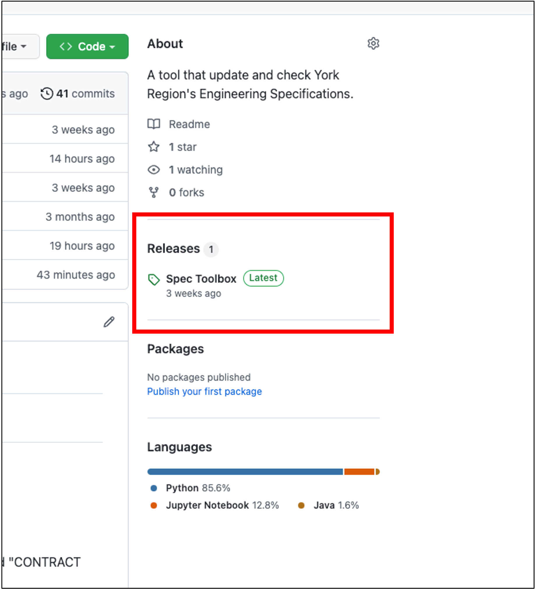
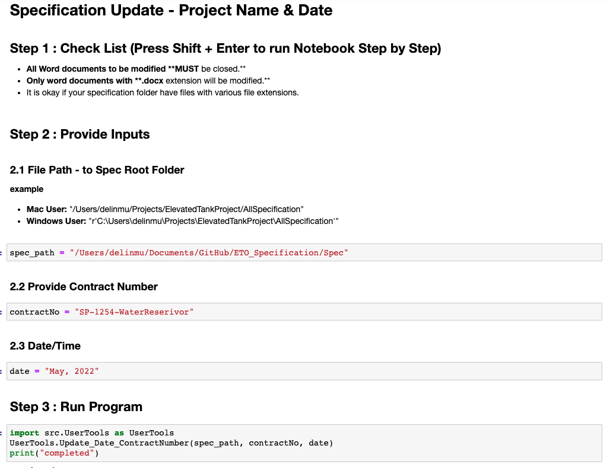

# Purpose
There are lots of manual work involved in developing an engineering specification.
To name a few: update project names, upgrade development dates, update repetitive contents.
The tool targets York Region's engineering specifications to simply some manual work and
generate a summary sheets for engineers to review information accuracy in the Specifications.

# User Guide - General Users
## Download Anaconda
Anaconda is a free and open-source distribution of Python and R programming languages for scientific computing (data science, machine learning applications, large-scale data processing, predictive analytics, etc.), 
that aims to simplify package management and deployment.

To download, click the [official Anaconda Link](https://www.anaconda.com/)

## Download Spec ToolBox
Click [the latest release V2.0.0](??) or see below. Download file name "Source code(zip)".
User only needs to interact with the following two ".ipynb"(Jupyter Notebook) files:
1. Specification Update - Project Name & Date: to update project name and date
2. Specification Update - Spec Summary Sheet: to generate summary sheet.

---

---

## Run Jupter Notebook in Anacoda environment
See below, click Jupter Notebook. Run the downloaded files under the Jupter Notebook
environment.

---

---

## Follow Instructions in Jupter Notebook
See below, follow the instructions in the Jupter Notebook to run the program.

---

---
